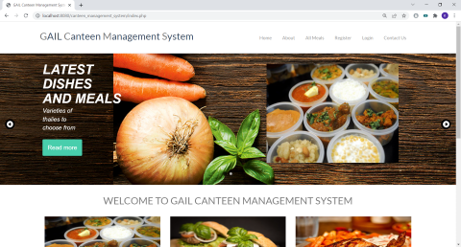
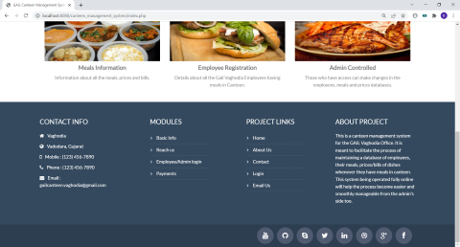
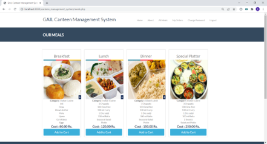
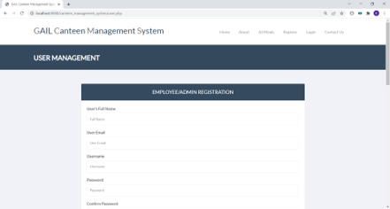
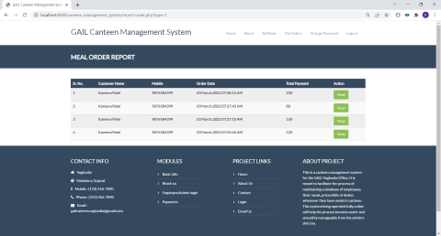
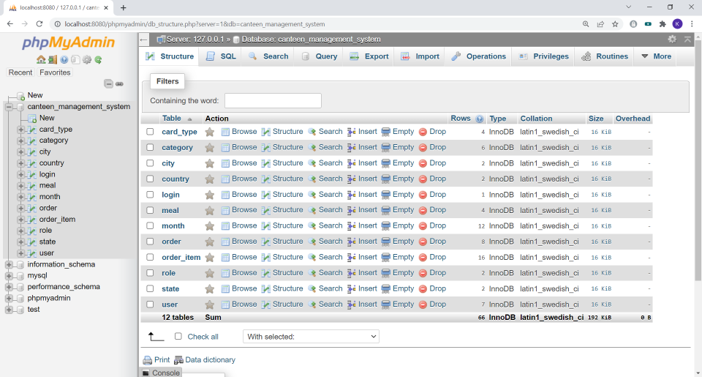

# Canteen Management System

A comprehensive web-based platform for managing canteen operations including meal ordering, payment processing, user management, and administrative reporting.

---

## Table of Contents

- [Project Overview](#project-overview)
- [Features](#features)
- [Technology Stack](#technology-stack)
- [System Architecture](#system-architecture)
- [Database Schema](#database-schema)
- [Project Structure](#project-structure)
- [Installation & Setup](#installation--setup)
- [Configuration](#configuration)
- [Usage Guide](#usage-guide)
- [Screenshots](#screenshots)
- [Key Features Details](#key-features-details)
- [File Descriptions](#file-descriptions)
- [API Endpoints](#api-endpoints)
- [Contributing](#contributing)

---

## Project Overview

The **Canteen Management System** is a full-stack web application designed to streamline canteen operations. It enables users to:

- Browse meal categories and options
- Place and track orders
- Process payments securely
- View order history and reports
- Manage user accounts

The system also provides administrative capabilities for managing meals, categories, users, and generating comprehensive reports.

---

## Features

### Customer Features

- ✅ **User Registration & Authentication** - Secure login system with session management
- ✅ **Meal Browsing** - Browse meals by category (Mughlai, Chinese, Indian, South Indian, Italian, Thalis)
- ✅ **Online Ordering** - Add meals to cart and place orders
- ✅ **Payment Processing** - Multiple payment card options (Visa, Mastercard, American Express, Rupay)
- ✅ **Order Tracking** - View order history and current order status
- ✅ **User Profile Management** - Update personal information and change passwords
- ✅ **Contact & Support** - Contact the canteen through the platform
- ✅ **About Section** - Learn more about the canteen

### Admin Features

- ✅ **User Management** - Add, edit, and manage user accounts
- ✅ **Meal Management** - Create and manage meal offerings with pricing
- ✅ **Category Management** - Organize meals into categories
- ✅ **Payment Gateway Integration** - Manage payment card types
- ✅ **Comprehensive Reports** - Generate reports for:
  - User analytics
  - Order analytics
  - Meal popularity
  - Category performance
  - Cart management
- ✅ **Order Management** - View and manage all customer orders
- ✅ **Geographical Support** - Multi-city support (Vadodara, Ahmedabad)

---

## Technology Stack

### Frontend

- **HTML5** - Markup structure
- **CSS3** - Styling and responsive design
  - Bootstrap Framework
  - Custom CSS themes
- **JavaScript** - Client-side interactivity
  - jQuery library
  - jQuery UI
  - jQuery Easing
  - Flexslider
  - Magnific Popup
  - MixItUp

### Backend

- **PHP** - Server-side scripting
- **MySQL/MariaDB** - Database management
- **Apache/IIS** - Web server (localhost:8080)

### Additional Technologies

- **Bootstrap** - Responsive UI framework
- **Font Awesome** - Icon library
- **Owl Carousel** - Image carousel
- **Sequence.js** - Modern slider
- **WOW.js** - Scroll animations
- **jQuery BX Slider** - Image slider

---

## System Architecture

```
┌─────────────────────────────────────────┐
│          Frontend Layer                  │
│  (HTML, CSS, JavaScript, jQuery)        │
└──────────────┬──────────────────────────┘
               │
┌──────────────▼──────────────────────────┐
│     Presentation Layer (PHP)             │
│  (Pages, Forms, Views)                  │
└──────────────┬──────────────────────────┘
               │
┌──────────────▼──────────────────────────┐
│    Business Logic Layer (PHP)            │
│  (lib/ directory - Functions, API)      │
└──────────────┬──────────────────────────┘
               │
┌──────────────▼──────────────────────────┐
│    Data Access Layer (PHP)               │
│  (includes/ - Database Connection)      │
└──────────────┬──────────────────────────┘
               │
┌──────────────▼──────────────────────────┐
│    Database Layer                        │
│  (MySQL - Data Storage)                 │
└─────────────────────────────────────────┘
```

---

## Database Schema

### Core Tables

#### `login` - User Authentication

- `login_id` (INT) - Primary Key
- `login_user` (VARCHAR) - Username
- `login_password` (VARCHAR) - Password
- `login_level` (VARCHAR) - User level/role
- `login_date` (INT) - Last login date

#### `user` - User Information

- `user_id` (INT) - Primary Key
- `user_name` (VARCHAR) - Full name
- `user_email` (VARCHAR) - Email address
- `user_address` (TEXT) - Address
- Country, State, City references

#### `meal` - Meal Offerings

- `meal_id` (INT) - Primary Key
- `meal_title` (VARCHAR) - Meal name
- `meal_category_id` (VARCHAR) - Category reference
- `meal_cost` (VARCHAR) - Price
- `meal_description` (TEXT) - Description
- `meal_image` (VARCHAR) - Image filename

#### `category` - Food Categories

- `category_id` (INT) - Primary Key
- `category_name` (VARCHAR) - Category name
- `category_description` (TEXT) - Category details

Available Categories:

1. Mughlai Foods - Non-vegetarian items
2. Chinese Foods - Asian cuisine
3. Indian Cuisine - Traditional Indian recipes
4. South Indian - Regional specialties
5. Italian - Pizzas and Italian dishes
6. Thalis - Multi-item meal combinations

#### `order` - Customer Orders

- `order_id` (INT) - Primary Key
- `order_user_id` (VARCHAR) - User reference
- `order_date` (VARCHAR) - Order timestamp
- `order_amount` (VARCHAR) - Total amount
- `order_status` (VARCHAR) - Status (Confirmed, Pending, etc.)

#### `order_item` - Order Details

- `oi_id` (INT) - Primary Key
- `oi_order_id` (VARCHAR) - Order reference
- `oi_product_id` (VARCHAR) - Meal reference
- `oi_price_per_unit` (VARCHAR) - Unit price
- `oi_cart_quantity` (VARCHAR) - Quantity
- `oi_total` (VARCHAR) - Line total

#### `card_type` - Payment Methods

- `ct_id` (INT) - Primary Key
- `ct_name` (VARCHAR) - Card type (Master Card, Visa, American Express, Rupay)

#### Supporting Tables

- `country` - Countries (India, USA)
- `city` - Cities (Vadodara, Ahmedabad)
- `month` - Month reference (January-December)
- `state` - State information

---

## Project Structure

```
canteen_management_system/
│
├── index.php                    # Home page with slider
├── login.php                    # User login page
├── about.php                    # About page
├── contact.php                  # Contact page
├── user.php                     # User profile management
├── meals.php                    # Meal listing page
├── meal.php                     # Individual meal details
├── category.php                 # Category browsing
├── payment.php                  # Payment processing
├── order-confirmation.php       # Order confirmation page
├── change-password.php          # Password change
├── report-*.php                 # Report pages
│   ├── report-user.php
│   ├── report-order.php
│   ├── report-meal.php
│   ├── report-category.php
│   ├── report-cart.php
│
├── assets/                      # Third-party libraries
│   ├── bxslider/              # Image slider
│   ├── font-awesome/          # Icon fonts
│   ├── owlcarousel/           # Carousel library
│
├── css/                         # Stylesheets
│   ├── bootstrap.css
│   ├── bootstrap-*.css
│   ├── style.css              # Main styles
│   ├── theme.css
│   ├── animate.css
│   ├── flexslider.css
│   ├── magnific-popup.css
│   ├── mixitup.css
│   ├── component.css
│   ├── jquery-ui.css
│   ├── superfish*.css
│   └── images/                # CSS-related images
│
├── js/                          # JavaScript files
│   ├── jquery*.js             # jQuery library
│   ├── bootstrap.js           # Bootstrap JS
│   ├── common-scripts.js      # Common functionality
│   ├── jquery-ui.js
│   ├── jquery.easing.min.js
│   ├── jquery.flexslider.js
│   ├── jquery.magnific-popup.js
│   ├── jquery.parallax*.js
│   ├── link-hover.js
│   ├── mixitup.js
│   ├── superfish.js
│   ├── wow.min.js             # Scroll animations
│   ├── hover-dropdown.js
│   ├── html5shiv.js
│   ├── parallax-slider/       # Slider scripts
│   └── seq-slider/            # Sequence slider
│
├── img/                         # Images
│   ├── banner/                # Banner images
│   ├── blog/                  # Blog images
│   ├── clients/               # Client logos
│   ├── parallax-slider/       # Slider images
│   ├── portfolios/            # Portfolio images
│   │   ├── app/
│   │   ├── card/
│   │   ├── icon/
│   │   ├── logo/
│   │   └── web/
│   ├── seq-slider/            # Sequence slider images
│   ├── team/                  # Team images
│   └── works/                 # Work samples
│
├── includes/                    # PHP includes
│   ├── header.php             # Page header template
│   ├── footer.php             # Page footer template
│   ├── db_connect.php         # Database connection
│   ├── functions.php          # Utility functions
│   ├── slider.php             # Slider template
│   └── dialog.php             # Dialog templates
│
├── lib/                         # Business logic
│   ├── login.php              # Login processing
│   ├── user.php               # User operations
│   ├── meal.php               # Meal operations
│   ├── category.php           # Category operations
│   ├── payment.php            # Payment processing
│   └── cart.php               # Cart management
│
├── uploads/                     # User uploads directory
│
├── fonts/                       # Font files
│
└── canteen_management_system.sql  # Database schema
```

---

## Installation & Setup

### Prerequisites

- PHP 5.6 or higher
- MySQL 5.1 or MariaDB 10.1+
- Apache Web Server with mod_rewrite
- Composer (optional, for package management)

### Step 1: Clone/Download Project

```bash
# Download the project files to your web root
# Windows: C:\xampp\htdocs\
# Linux: /var/www/html/
```

### Step 2: Create Database

```bash
# Open phpMyAdmin or MySQL command line
mysql -u root -p

# Create database and import schema
CREATE DATABASE canteen_management_system;
USE canteen_management_system;
SOURCE /path/to/canteen_management_system.sql;
```

### Step 3: Configure Database Connection

Edit `includes/db_connect.php`:

```php
<?php
global $con;
$con = mysqli_connect(
    "127.0.0.1",              // Database host
    "root",                   // Database user
    "",                       // Database password
    "canteen_management_system"  // Database name
);
```

### Step 4: Update Server Path

Edit `includes/functions.php`:

```php
$SERVER_PATH = "http://localhost:8080/canteen_management_system/";
$Currency = "USD";
```

### Step 5: Set File Permissions

```bash
# Linux/Mac
chmod 755 uploads/
chmod 755 includes/
```

### Step 6: Access the Application

```
http://localhost:8080/canteen_management_system/
```

---

## Configuration

### Database Configuration

**File:** `includes/db_connect.php`

```php
$con = mysqli_connect(
    "HOST",           // 127.0.0.1 for local
    "USER",           // root or your username
    "PASSWORD",       // leave blank for root
    "DATABASE_NAME"   // canteen_management_system
);
```

### Application Configuration

**File:** `includes/functions.php`

```php
$SERVER_PATH = "http://localhost:8080/canteen_management_system/";
$Currency = "USD";
```

### Session Management

- Sessions are initialized in `functions.php`
- Default session timeout: PHP default (1440 seconds / 24 minutes)

---

## Usage Guide

### For Customers

#### 1. Registration & Login

- Click on Login page
- Create new account or use credentials
- Default admin user: `admin` / `test`

#### 2. Browsing Meals

- Go to "Meals" or "Browse Categories"
- Select desired category
- View meal details and pricing

#### 3. Placing an Order

- Add items to cart
- Proceed to checkout
- Enter delivery address
- Select payment method
- Confirm payment
- Receive order confirmation

#### 4. Tracking Orders

- Go to user profile
- View order history
- Check order status

#### 5. Payment Options

- Master Card
- Visa Card
- American Express
- Rupay

### For Administrators

#### 1. Admin Login

- Username: `admin`
- Password: `test`

#### 2. Managing Meals

- Go to Meal Management
- Add new meal with:
  - Title
  - Category
  - Price
  - Description
  - Image

#### 3. Managing Categories

- Organize meals into categories
- Add category descriptions
- Update meal assignments

#### 4. User Management

- View all registered users
- Edit user information
- Manage user access levels

#### 5. Reports

- **User Reports** - User registration analytics
- **Order Reports** - Sales and order data
- **Meal Reports** - Popular meals and performance
- **Category Reports** - Category-wise analytics
- **Cart Reports** - Abandoned cart analysis

---

## Screenshots

### Frontend Screenshots

#### 1. Home Page


_Landing page with featured meals and call-to-action_

#### 2. Meal Browsing


_Browse and filter meals by category_

#### 3. Meal Details


_Detailed view of individual meal with pricing and description_

#### 4. Shopping Cart


_Cart management and order review_

#### 5. Payment Page


_Secure payment gateway integration_

### Backend Screenshots

#### 1. Admin Dashboard


_Administrative dashboard with key metrics and quick actions_

---

## Key Features Details

### 1. User Authentication System

- Secure login with PHP sessions
- Password hashing (recommended: upgrade to bcrypt)
- Role-based access control
- Session timeout protection

### 2. Shopping Cart System

```php
// Located in: lib/cart.php
- Add to cart
- Update quantity
- Remove items
- Calculate totals
- Session-based persistence
```

### 3. Payment Processing

```php
// Located in: payment.php
- Multiple card type support
- Payment validation
- Order confirmation
- Receipt generation
```

### 4. Reporting System

The system includes comprehensive reporting:

- SQL-based queries
- Data aggregation
- Period-wise analysis
- Export capabilities

### 5. Category Management

Six food categories:

1. **Mughlai Foods** - Non-vegetarian Mughlai cuisine
2. **Chinese Foods** - Asian Chinese dishes
3. **Indian Cuisine** - Traditional Indian recipes
4. **South Indian** - Regional South Indian specialties
5. **Italian** - Italian pizzas and pasta
6. **Thalis** - Multi-item meal packages

### 6. Meal Types

- **Breakfast** - ₹80
- **Lunch** - ₹120
- **Dinner** - ₹150
- **Special Platter** - ₹250

---

## File Descriptions

### Core Pages

| File                     | Purpose                                          |
| ------------------------ | ------------------------------------------------ |
| `index.php`              | Home page with Sequence slider and meal showcase |
| `login.php`              | User login and authentication interface          |
| `user.php`               | User profile management                          |
| `meals.php`              | Meal listing and browsing                        |
| `meal.php`               | Individual meal detail page                      |
| `category.php`           | Category-based meal browsing                     |
| `payment.php`            | Payment processing form                          |
| `order-confirmation.php` | Order confirmation display                       |
| `about.php`              | About the canteen                                |
| `contact.php`            | Contact form                                     |
| `change-password.php`    | Password change interface                        |

### Business Logic (lib/)

| File           | Purpose              |
| -------------- | -------------------- |
| `login.php`    | Authentication logic |
| `user.php`     | User CRUD operations |
| `meal.php`     | Meal data management |
| `category.php` | Category management  |
| `payment.php`  | Payment processing   |
| `cart.php`     | Shopping cart logic  |

### Includes

| File             | Purpose                    |
| ---------------- | -------------------------- |
| `header.php`     | Navigation and page header |
| `footer.php`     | Footer and closing tags    |
| `db_connect.php` | MySQL connection           |
| `functions.php`  | Utility functions          |
| `slider.php`     | Image slider template      |
| `dialog.php`     | Modal dialogs              |

### Reporting Pages

| File                  | Purpose                       |
| --------------------- | ----------------------------- |
| `report-user.php`     | User statistics and analytics |
| `report-meal.php`     | Meal performance reports      |
| `report-order.php`    | Order analytics               |
| `report-category.php` | Category-wise reports         |
| `report-cart.php`     | Cart analysis                 |

---

## API Endpoints

### User Endpoints

```
POST /lib/login.php?act=check_login
  - user_user: username
  - user_password: password

POST /lib/user.php
  - act: action (create, update, delete)
  - user_*: user fields
```

### Meal Endpoints

```
GET /lib/meal.php?act=list
GET /lib/meal.php?act=get&id=meal_id
POST /lib/meal.php?act=save
POST /lib/meal.php?act=delete&id=meal_id
```

### Order Endpoints

```
GET /lib/cart.php?act=view
POST /lib/cart.php?act=add&meal_id=id&qty=quantity
POST /lib/cart.php?act=remove&item_id=id
POST /payment.php?act=process
```

### Category Endpoints

```
GET /lib/category.php?act=list
GET /lib/category.php?act=get&id=category_id
POST /lib/category.php?act=save
```

---

## Security Recommendations

### Current Implementation

- Session-based authentication
- Server-side validation

### Recommended Enhancements

1. **Password Security**

   - Use bcrypt or Argon2 hashing
   - Implement password strength requirements
   - Add account lockout after failed attempts

2. **Input Validation**

   - Use prepared statements for all queries
   - Sanitize and validate all user inputs
   - Implement CSRF protection

3. **Data Protection**

   - Use HTTPS for payment processing
   - Implement SSL certificate
   - Encrypt sensitive data in database

4. **Access Control**

   - Implement proper role-based access control (RBAC)
   - Add permission checks for admin functions
   - Log all admin activities

5. **Error Handling**
   - Hide database errors from users
   - Implement proper error logging
   - Create user-friendly error messages

---

## Troubleshooting

### Common Issues

#### Database Connection Error

```
Error: Unable to connect to MySQL
```

**Solution:** Check `includes/db_connect.php` configuration:

- Verify MySQL is running
- Check host, username, password
- Ensure database exists

#### Page Not Found

```
404 - File not found
```

**Solution:**

- Verify server path in `includes/functions.php`
- Check file locations and names
- Ensure Apache mod_rewrite is enabled

#### Payment Processing Fails

**Solution:**

- Verify card details are correct
- Check payment gateway configuration
- Ensure SSL is enabled

#### Image Not Displaying

**Solution:**

- Verify image files exist in `img/` directory
- Check file permissions (755)
- Verify paths in image tags

---

## Contributing

### Development Guidelines

1. Follow PHP PSR-12 coding standards
2. Use descriptive variable and function names
3. Add comments for complex logic
4. Test all changes thoroughly
5. Update documentation

### Reporting Issues

1. Document the issue clearly
2. Include error messages
3. Provide steps to reproduce
4. Submit with version information

### Pull Requests

1. Create feature branch
2. Make focused changes
3. Test thoroughly
4. Write clear commit messages
5. Submit with documentation

---

## License

This project is provided as-is for educational and commercial use.

---

## Support & Contact

For technical support and inquiries:

- Use the Contact page in the application
- Check the About section for more information
- Review database schema for data structure

---

## Version History

**Version 1.0** (March 2022)

- Initial release
- Core meal ordering functionality
- User authentication
- Payment processing
- Basic reporting

---

## Future Enhancements

- [ ] Mobile application
- [ ] Email notifications
- [ ] Real-time order tracking
- [ ] Customer reviews and ratings
- [ ] Loyalty program
- [ ] Advanced analytics dashboard
- [ ] Integration with delivery partners
- [ ] Subscription meal plans
- [ ] Multi-language support
- [ ] Progressive Web App (PWA)

---

**Last Updated:** January 2026

For more information, navigate through the application or contact the support team via the Contact page.
